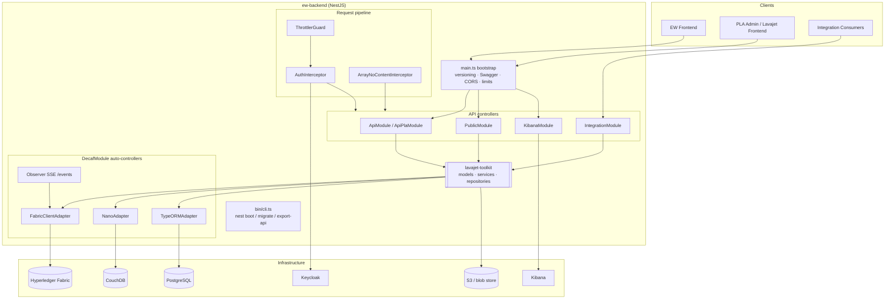

# Architecture

## Component view



## Runtime stack

* **NestJS 11 on Node 24** — `src/main.ts` creates the application, configures
  body parsers, CORS, URI versioning, Swagger and the global throttler guard.
  The container entrypoint is `node lib/bin/cli.js nest boot`
  (`Dockerfile:98`), which routes through `src/bin/cli.ts`.
* **Decaf-ts core** — `@decaf-ts/core` owns models, repositories, services,
  queries and tasks. `DecafModule.forRootAsync` registers the persistence
  flavours, auto-controllers, observer options and handlers
  (`src/app.module.ts:132`, `src/app-pla.module.ts:137`).
* **Hyperledger Fabric** — `FabricClientAdapter` (`@decaf-ts/for-fabric`) is the
  primary ledger flavour (`FabricFlavour`).
* **CouchDB / Nano** — `NanoAdapter` (`@decaf-ts/for-nano`) backs the
  credential database and the task database.
* **PostgreSQL / TypeORM** — `TypeORMAdapter` (`@decaf-ts/for-typeorm`) is used
  only by the PLA build for account, token, Keycloak and Kibana configuration
  records.
* **Kibana** — a proxied, session-guarded Kibana space (`src/kibana/**`).
* **Keycloak** — OIDC/JWKS token validation and Fabric identity binding
  (`src/auth/**`).

## Application module composition

### EW (MAH) — `src/app.module.ts`

```
AppModule
├── AuthModule                      # global: JWT, Keycloak auth handler, Fabric identity
├── ApiModule                       # auth, account, infrastructure, leaflet-resolver, public, integration
├── DecafModule.forRootAsync
│   ├── FabricClientAdapter   (FabricFlavour)
│   ├── NanoAdapter           (credentials db)
│   ├── NanoAdapter "tasks"    (task engine)
│   ├── autoControllers: true
│   ├── observerOptions       (SSE at /events, FabricFlavour + "tasks")
│   └── initialization        → Service.boot()
├── KibanaModule
├── ThrottlerModule
└── ScheduleModule                   # ResolverTasksService cron jobs
```

### PLA (Admin) — `src/app-pla.module.ts`

```
AppModule (PLA)
├── AuthModule
├── ApiPlaModule                   # auth, account, infrastructure
├── DecafModule.forRootAsync
│   ├── FabricClientAdapter   (FabricFlavour)
│   ├── TypeORMAdapter        (Postgres)
│   ├── NanoAdapter           (credentials db)
│   ├── NanoAdapter "tasks"
│   └── autoControllers: true
├── KibanaModule
└── ThrottlerModule
```

The PLA module does not include `ScheduleModule` or `ResolverTasksService`; the
resolver cron belongs to the MAH build.

## API module tree

| Module              | File                                        | Purpose                                                                                                  |
|---------------------|---------------------------------------------|----------------------------------------------------------------------------------------------------------|
| `ApiModule`         | `src/api/api.module.ts`                     | EW controllers: auth, account, infrastructure, leaflet-resolver; imports public and integration modules. |
| `ApiPlaModule`      | `src/api/api-pla.module.ts`                 | PLA controllers: auth, account, infrastructure.                                                          |
| `PublicModule`      | `src/api/public/public.module.ts`           | Public reads: owner, metadata, leaflet, leaflet-resolver.                                                |
| `PublicPlaModule`   | `src/api/public/public-pla.module.ts`       | Public PLA reads: owner, validate, leaflet-resolver.                                                     |
| `IntegrationModule` | `src/api/integration/integration.module.ts` | Legacy `/integration` routes under `RouterModule` path `integration`.                                    |
| `KibanaModule`      | `src/kibana/kibana.module.ts`               | `/kibana` proxy controller and CSP middleware.                                                           |

## Request pipeline

1. **Global throttler** — `ThrottlerGuard` is registered as `APP_GUARD`
   (`src/app.module.ts:260`). The default window is
   `Environment.throttling.defaultTtlMs` / `defaultLimit`; public controllers
   override it with `publicTtlMs` / `publicLimit`.
2. **Body limits** — JSON and URL-encoded parsers are capped from
   `Environment.limits` (`src/main.ts:48-54`).
3. **CORS** — enabled from `Environment.cors`; a `*` origin is expanded to a
   reflect-origin callback, and the verb/header lists are parsed from the same
   config (`src/main.ts:57-90`).
4. **Auth interceptor** — `AuthInterceptor` from `@decaf-ts/for-nest` runs globally
   through `AuthModule` and delegates to `FabricKeycloakAuthHandler`.
5. **Versioning** — URI versioning with `defaultVersion: "1"`. The paths
   `/api`, `/api-json` and `/kibana` are whitelisted from version prefixing via
   `Environment.versionWhiteList` and `versionWhiteListSeperator`
   (`src/main.ts:34-41`).
6. **Response shaping** — `ArrayNoContentInterceptor` converts empty array
   results to `204` (`src/handlers/ArrayNoContent.interceptor.ts`).

## Authentication and authorization

`FabricKeycloakAuthHandler` (`src/auth/keycloakAuthHandler.ts`) extends the
framework `KeycloakAuthHandler` and adds:

* JWKS token validation, delegated to `JwtService`
  (`src/auth/jwtService.ts`), which reads `jwt.secretKey`, `jwt.expiry`,
  `verifyToken` and `verifyUrl` from the environment.
* Fabric identity lookup, re-enrolment and credential binding onto the request
  context.
* PLA role checks — reader/writer/admin levels and prefix checks implemented in
  `src/auth/utils.ts` (`isReader`, `isWriter`, `isAdmin`, `isPlaReader`,
  `isPlaAdmin`, `isPla`, `canShowQueryInput`).
* `@SkipFabricIdentity()` — validates the JWT and roles but skips the Fabric
  identity lookup, for routes that never submit a transaction.
* Public leaflet `external` writes live under `/public` but still submit Fabric
  transactions, so they are explicitly re-routed through the authenticated path.

## Observer events

The decaf model module enables observer events and exposes them over SSE at
`EVENTS_API_PATH` (`/events`) for the `FabricFlavour` and `"tasks"` flavours
(`src/app.module.ts:226-232`, `src/app-pla.module.ts:238-246`). The stream is
token-bound by the auth handler. This is what surfaces as the `/events` and
`/events/{model}` routes in the OpenAPI document.

## Kibana proxy

`KibanaController` is version-neutral and proxies `/kibana/{path}` for every HTTP
method, with `/kibana/auth` for session establishment. `KibanaCspMiddleware`
rewrites the Content-Security-Policy for the proxied space, and
`KibanaSessionGuard` binds the proxied session to the authenticated user.

## Infrastructure orchestration

The PLA build exposes `/infrastructure/*` routes that drive organisation
onboarding and contract deployment: `InfrastructureService` and `AccountService` from
the toolkit perform the work, while `InfrastructurePLAController` only validates and
forwards input. The MAH build exposes the two token-protected join/deploy routes.

## Persistence

See [Persistence](LAVAJET_05_1_Persistence.md) for the adapter matrix, flavours and
the operation blocks declared in the application modules.

## Configuration

Every runtime value is read through the accumulated decaf `Environment` object
(`src/utils/environment.ts`, `src/utils/pla-environment.ts`). See
[Environment](LAVAJET_05_9_Environment.md) for the full inventory of variables
the backend actually consumes.
