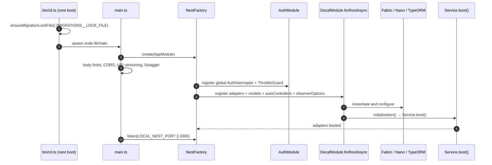
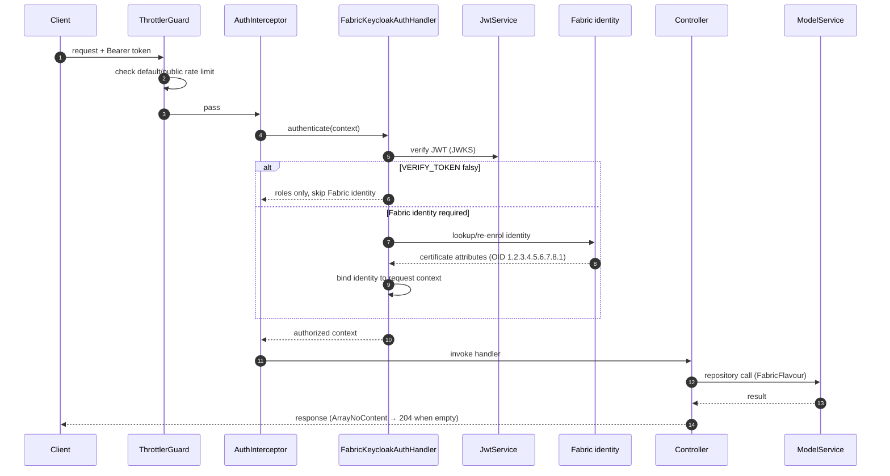
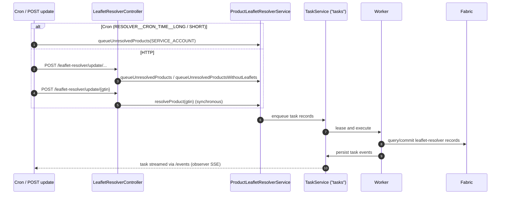
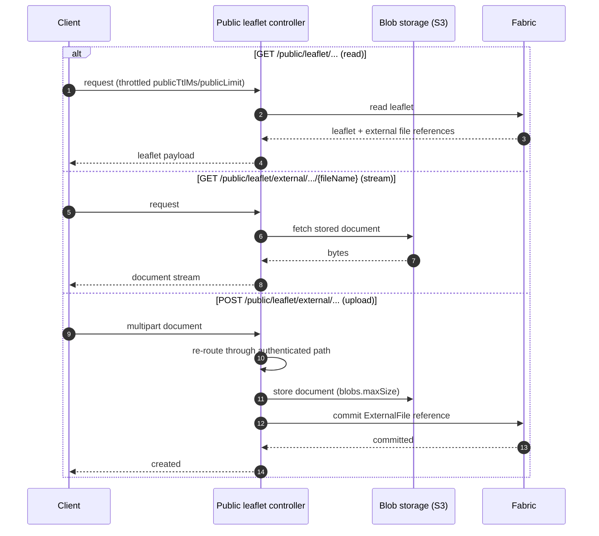
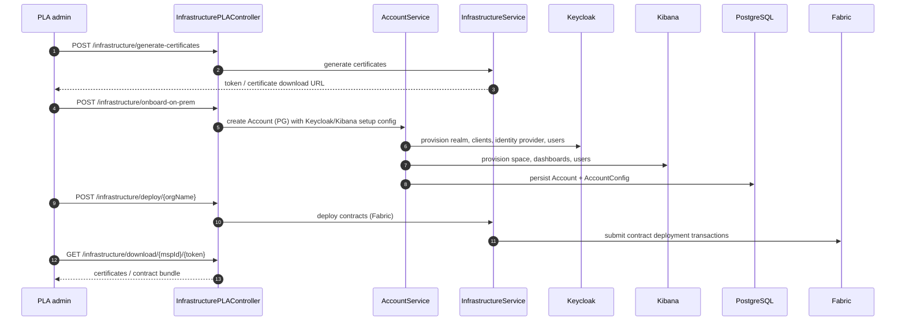

# Sequences

These diagrams describe the principal runtime flows. They are derived from the
controllers, interceptors and services referenced inline; the concrete contract
execution and adapter internals live in the toolkit.

## 1. Application boot

## 2. Authenticated Fabric request

## 3. Leaflet resolver task

## 4. Public leaflet read and external document upload

## 5. PLA onboarding and deployment

